<h3 align="center">Hi , I'm Ben</h1>
<h4 align="center">I'm a Software Engineer based in Melbourne, Australia.</h3>

## 🧑🏻‍💻 Main Skills

 
 
 
 

## 🛠️ Worked With
 
 
 
 
 
 

## 🤖 Stats

 

## 🧪 Things I've made

- [OzPay101.com](https://ozpay101.com) &rarr; A clean, user-friendly Aussie pay calculator website 💰
- [Remind Me Later](https://www.npmjs.com/package/remind-me-later) &rarr; An npm reminder tool for your forgotten TODO/FIXME comments 🧠
- [Melbourne Trams](https://bendiep.com/blog/now-on-tidbyt-melbourne-buses-and-trams) &rarr; Real-time Melbourne Tram departures on Tidbyt 🚊
- [Melbourne Buses](https://bendiep.com/blog/now-on-tidbyt-melbourne-buses-and-trams) &rarr; Real-time Melbourne Bus departures on Tidbyt 🚌
- [Melbourne Trains](https://bendiep.com/blog/i-built-a-tidbyt-app-melbourne-trains) &rarr; Real-time Melbourne Train departures on Tidbyt 🚆

<!--
**bendiep/bendiep** is a ✨ _special_ ✨ repository because its `README.md` (this file) appears on your GitHub profile.

Here are some ideas to get you started:

- 🔭 I’m currently working on ...
- 🌱 I’m currently learning ...
- 👯 I’m looking to collaborate on ...
- 🤔 I’m looking for help with ...
- 💬 Ask me about ...
- 📫 How to reach me: ...
- 😄 Pronouns: ...
- ⚡ Fun fact: ...
- 👨‍💻 Open Source Contributions: ...
- 🤖 Some Cool Stuff I've Built: ...
- 🎮 Interests: ...
- 📞 Contact: ...
-->
